# Nondestructive Testing Robot

## Table of Contents

- [Robot](#robot)
  - [Chassis](#chassis)
  - [Motors](#motors)
  - [Batteries](#batteries)
  - [Motor Driver](#motor-driver)
  - [CAVeBoard-Mini](#caveboard-mini)
    - [Programming](#programming)
  - [CAVeWare](#caveware)
    - [Building From Source](#building-from-source)
    - [BSP](#bsp)
    - [CAVeTalk](#cavetalk)
    - [Rover 4WD](#rover-4wd)
    - [Motion Profiler](#motion-profiler)
    - [Logging](#logging)
  - [CAVeBox](#cavebox)
- [Sensor](#sensor)
  - [Teensy Replacement](#teensy-replacement)
  - [Linear Actuator](#linear-actuator)
  - [Communication](#communication)
- [Operation](#operation)

## Robot

TODO insert picture with callouts

### Chassis

The chassis is primarily constructed from MDF and two aluminum U-channels, which are joined by M4 bolts.  The sensor mount on the front of the robot is also constructed from aluminum U-channel and brackets.  All aluminum U-channels and brackets are from [goBilda](https://www.gobilda.com/). 

### Wheels

The wheels are [6" traction wheels](https://www.vexrobotics.com/traction-wheels.html) from VEX Robotics.  They are fixed to the motors using the [1206 Series Pattern Adaptor](https://www.gobilda.com/1206-series-pattern-adaptor-16-5-2-pack/) and the [1312 Series Double Sonic Hub for 6mm D-Bore](https://www.gobilda.com/1312-series-double-sonic-hub-6mm-d-bore/) from goBILDA.

### Motors

The robot uses four [5202 Series Yellow Jacket Planetary Gear Motors](https://www.gobilda.com/5202-series-yellow-jacket-planetary-gear-motor-26-9-1-ratio-24mm-length-6mm-d-shaft-223-rpm-36mm-gearbox-3-3-5v-encoder/) in a differential drive, or skid steer, configuration.  These are brushed DC motors that have a 6mm D shaft and planetary gear box.  They run on 12V DC and have a max speed of 223 RPM, max torque of  38.0 kg.cm, and draw max current of 9.2A.  They also have builtin quadrature encoders which take 3.3 - 5V and produce 751.8 pulses per revolution at the output shaft.

### Batteries

The robot is powered by two 12V 15Ah LiFePO4 batteries wired in parallel, connected to a bus bar for power distribution.

### Motor Driver

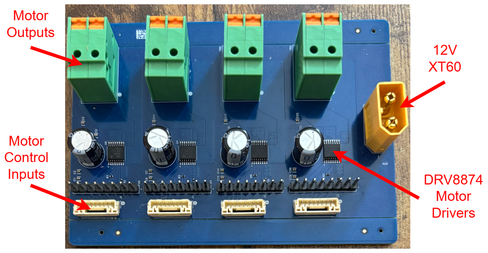_Motor Driver board_

The motor driver PCB is responsible for driving the four brushed DC motors.  The board is based on the DRV8874 H-Bridge Motor Driver, which can supply a peak current of 6A to each motor and are configured to operate PWM Control Mode.  Each motor driver has an enable pin (nSleep), fault pin, and current sense pin in addition to two PWM inputs and low-side voltage inputs.  These pins are broken out to both standard male pin headers and JST GH connectors and are 3.3V logic.  12V power is supplied to the motor driver board via a XT60 connector.  For more information, please see the datasheet for the DRV8874 and the "MotorBoard" Altium project.

### CAVeBoard-Mini

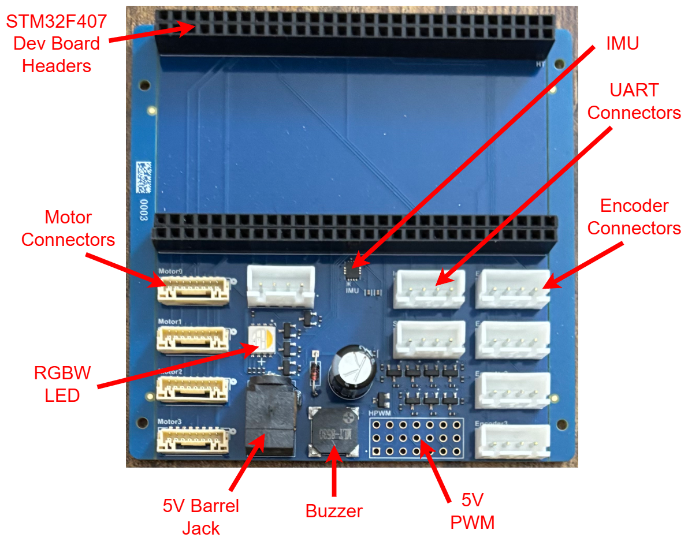_CAVeBoard-Mini_

The robot is controlled by the CAVeBoard-Mini running the CAVeware firmware.  This PCB has headers for this [STM32F407GZT6 development board](https://a.co/d/8tSHE93) as well as JST GH connectors for four brushed DC motors (low-side 3.3V logic), JST XH connectors for four 3.3V quadrature encoders, JST XH connectors for three UARTs, and standard pin headers for seven miscellanous 5V PWM outputs.  The CAVeBoard-Mini also features an RGBW LED, buzzer, and 6-axis LSM6DSV16X IMU connected via SPI.  The board is powered by a 5V barrel jack.  For more information, consult the "CAVeBoard-Mini" Altium project.  The CAVeBoard-Mini is mounted in the center of the robot on a 3D-printed bracket that straddles the batteries

#### Programming

The board can be programmed via Serial Wire Debug (SWD).  Connect the SWD pins on the STM32 development board to the SWD pins on an ST-LINK and flash using OpenOCD or [STM32CubeProgrammer](https://www.st.com/en/development-tools/stm32cubeprog.html).

If using STM32CubeProgrammer, select "Erasing & Programming" from the left-side menu, connect to the ST-LINK using SWD, set the path to the `CAVeware.elf` (see the [CAVeware](#caveware) section for downloading or building from source), and then click "Start Programming".  In order for the firmware to start running after programming, the "Run after programming" box must be checked, otherwise a board reset is required.

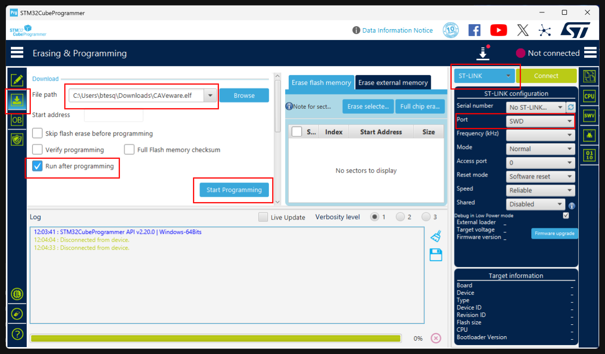_STM32CubeProgrammer Options_

OpenOCD alone can also be used to program the board, but GDB can be used with OpenOCD as well.  To use GDB with OpenOCD to program the board, start OpenOCD using the command `openocd -f <path to ST-LINK config> -f <path to STM32F4 config>`, e.g. on Linux `openocd -f /usr/share/openocd/scripts/interface/stlink-v2.cfg -f /usr/share/openocd/scripts/target/stm32f4x.cfg`.  Then launch GDB with the path to the `CAVeware.elf` (again see the [CAVeware](#caveware) section for downloading or building from source).  It is important to note that `gdb-multiarch` will most likely be needed.  This command might look like `gdb-multiarch build/CAVeBoard-Mini_Release/CAVeware.elf` if building from source.  OpenOCD should automatically launch a GDB server on `localhost:3333`, so connect to that after launching GDB using the command `target extended-remoted localhost:3333`.  Then program and run with `load` and `r`, respectively.

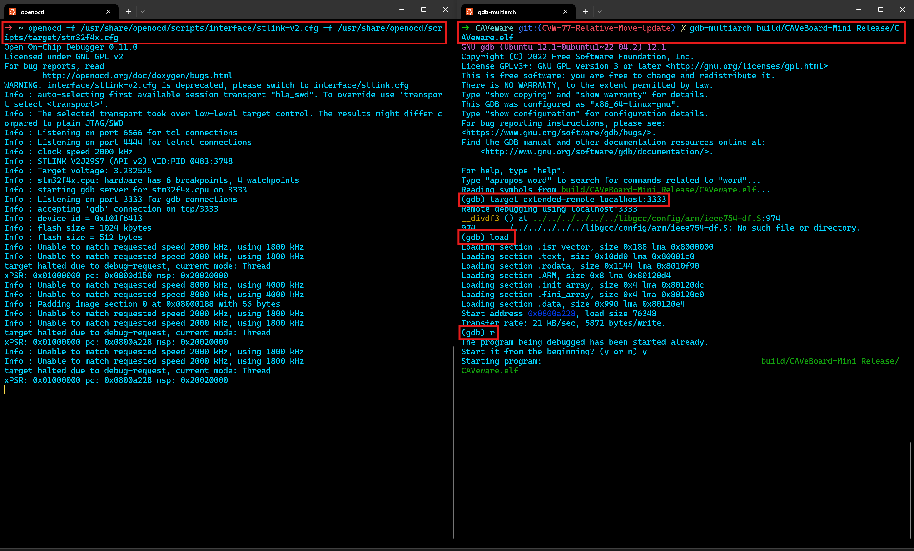_OpenOCD + GDB_

### CAVeware

The CAVeBoard-Mini runs the CAVeware firmware, which can be found on Github at [CAVeRobotics/CAVeware: Firmware for the CAVeBot](https://github.com/CAVeRobotics/CAVeware).  The latest version can either be downloaded from the [Releases](https://github.com/CAVeRobotics/CAVeware/releases/latest) or built from source.  In either case, it can be flashed to the CAVeBoard-Mini using the instructions in the previous section.

#### Building From Source

Prerequisites

- CMake (>= 3.30)

- Ninja

- GNU ARM Toolchain

- STM32CubeMX
1. Clone the [CAVeware](https://github.com/CAVeRobotics/CAVeware) repository and checkout the tag for the latest release, which can be found at [Releases](https://github.com/CAVeRobotics/CAVeware/releases/latest).

2. Navigate to the `boards/CAVeBoard-Mini/generated` directory and open `CAVeBoard-Mini.ioc` in STM32CubeMX.  Click the blue "GENERATE CODE" button in the upper right corner of the window.

3. Select and build the "Release" version of the firmware by running `cmake --preset CAVeBoard-Mini_Release` followed by `cmake --build --preset CAVeBoard-Mini_Release`.  The final binary will be located in `build/CAVeBoard-Mini_Release`.

#### BSP

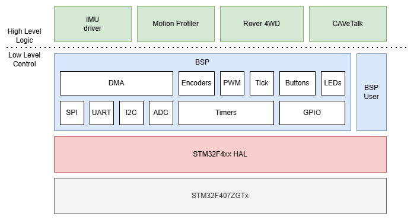_CAVeware Software Stack_

The BSP, or Board Support Package, provides a reusable interface across multiple boards that run CAVeware.  Currently, it wraps the STM32 HAL but it could easily be extended to support potential future non-STM32 boards.  The BSP supports several peripherals including ADCs, quadrature encoders, GPIO, brushed DC motors, servos, general PWM, SPI, timers, and UART.  It also provides a time source and logging utilities.  Peripherals can be selectively enabled at compile time depending on what a given board supports.

#### CAVeTalk

CAVeTalk is the serial protocol used to communicate with the CAVeBoard-Mini over UART.  It defines how commands are sent to the robot and how telemetry is received from the robot.  For more information, see [GitHub - CAVEMaN-SeniorDesign/CAVeTalk: CAVEMAN controller message protocol](https://github.com/CAVEMaN-SeniorDesign/CAVeTalk).  To send and receive data with CAVeTalk, connect to the "Interface" UART (USART1) with the following settings:

- Baud rate: 1000000 bits/s

- 8N1

#### Rover 4WD

The robot uses four-wheel differential drive, or skid steer, configuration.  For a given linear speed and angular speed, the differential drive controller calculates invididual wheel speeds using the following kinematics.

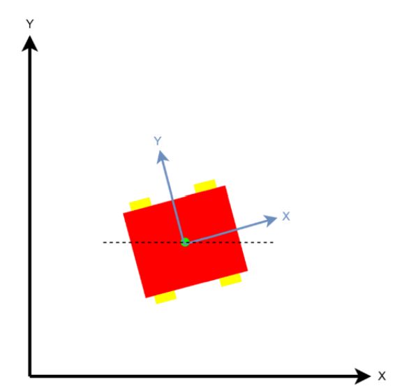_Four-Wheel Differential Model_

$$ \omega_L = \frac{2v_B - w\dot{\theta}}{2r} $$

$$ \omega_R = \frac{2v_B + w\dot{\theta}}{2r} $$

where
- $\omega_L$ = angular velocity of left wheels
- $\omega_R$ = angular velocity of right wheels
- $v_B$  = velocity in body frame, aligned with boxy X axis
- $\dot{\theta}$ = turn rate
- $w$ = tread
- $r$ = wheel radius

For each wheel, the differential drive controller applies PID control to the wheel speed using the wheel speed calculated above as the reference and velocity calculated from the corresponding encoder as the feedback.

#### Motion Profiler

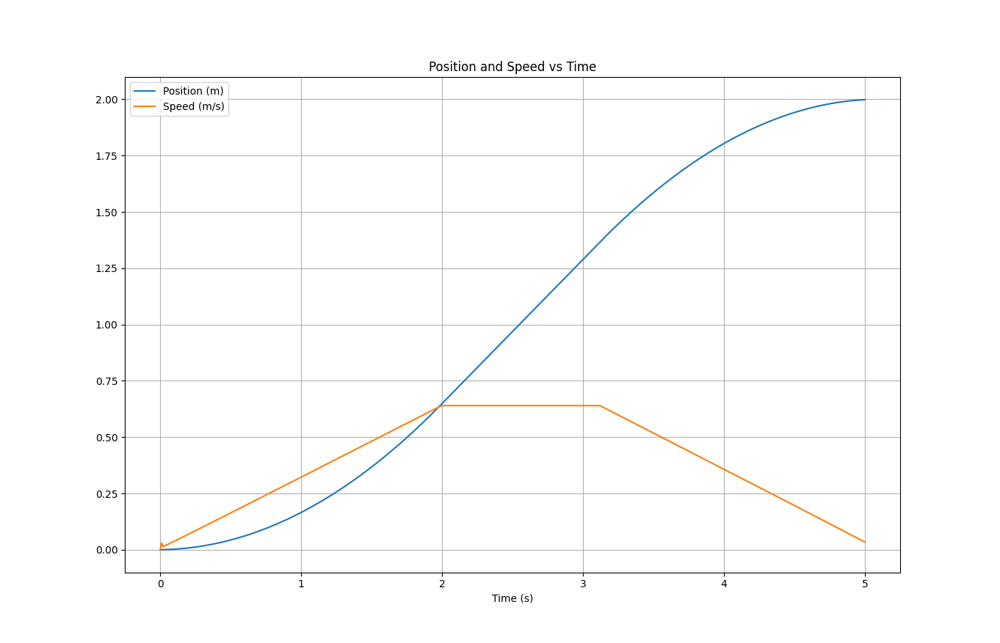_Trapezoidal Speed Profile_

When the robot is sent the command to move to a particular position, the motion profiler generates a trapezoidal speed profile to achieve the desired position.  The output of the motion profile is fed to the input of the Rover 4WD differential drive controller.  All together, the control structure looks something like the following, with a simple complementary filter fusing data from the encoders and IMU to estimate position and yaw.

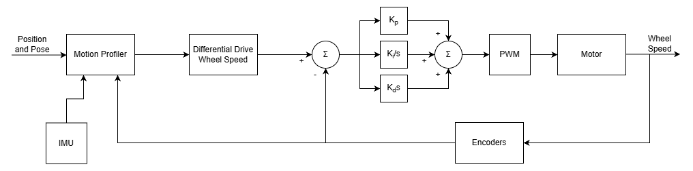_Full Motor Control Loop_

#### Logging

Firmware logs are printed out the "Logging" UART (USART6) with the following settings:

- 460800 bits/s

- 8N1

### CAVeBox

CAVeBox is gateway software that runs on a Raspberry Pi and allows the robot to receive commands and send telemetry wirelessly over Websockets using non-CAVeTalk messages.  CAVeBox also provides the ability to manually drive the robot using an Xbox  controller paired with the Pi.  Additionally, CAVeBox provides a means of wirelessly communicating the non-destructive testing sensor mounted on the robot as well.  The CAVeBox software can be found at [GitHub - CAVeRobotics/CAVeBox](https://github.com/CAVeRobotics/CAVeBox).  Currently, it must be built from source in order to use it.  If cross-compiling from source for an aarch64 target such as the Rapsberry Pi, it is recommended to use the included Docker container as it provides an aarch64 sysroot.  It is also recommended to run Ubuntu Server for use on a Raspberry Pi, as this is the only OS CAVeBox has been tested with.

To build CAVeBox from source for the Raspberry Pi:

1. Clone the CAVeBox repository, navigate to `tools/docker`, and run `docker compose build`, followed by `docker compose run --rm -it aarch64-build /bin/bash` to start the container and drop into a shell with the CAVeBox repository as the working directory.

2. Follow the instructions in the `README.md` to build the Protobufs and CAVeTalk for aarch64.

3. Run `cmake --preset aarch64_Release` followed by `cmake --build --preset aarch64_Release`.  The final binary will be located at `build/aarch64_Release/CAVeBox`.  Copy this binary to a Pi running Ubuntu Server if applicable.

See the [Operation](#operation) section for more information about CAVeBox is used.

## Sensor

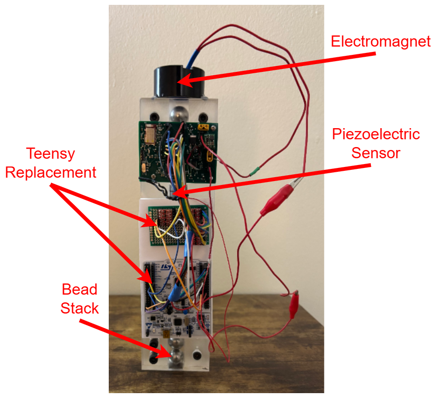_Sensor_

The non-destructive testing sensor works be generating highly nonlinear solitary waves by using an electromagnetic to lift and drop the top bead in a stack of metal beads.  In the middle of the stack is a piezoelectric sensor that measures the outgoing wave and the return wave.  The output from the piezoelectric sensor goes through an amplifier and an parallel 12-bit ADC is used to the read the ouput voltage from the amplifier, though only the upper eight bits are read.  The ADC is controlled by a clock line and is sampled at around 2 MHz.  To generate a complete waveform from the sensor, the ADC is sampled roughly 3000 times.

### Teensy Replacement

The original sensor design used a Teensy 3.2 Development Board.  However, this board has been discontinued, and newer versions of the Teensy cannot be directly swapped in because IO on the Teensy 3.2 was 5V logic while newer versions are 3.3V logic.  Therefore, an STM32 Nucleo-64 development board with 3.3V to 5V level shifters was used in place of the original Teensy 3.2.  The STM32 controls the electromagnetic and ADC clock each with a single GPIO line.  The lower eight bits of the input data register for GPIO Port C are connected to the upper eight bits of the ADC.  When sampling the ADC, a 2 MHz timer is used to trigger successive DMA reads of the input data register.  The CAVeware BSP is also used on this board to manage peripherals.  The Nucleo-64 development board features a builtin ST-LINK which can be used to flash the firmware via the USB Mini B in a similar manner to programming the CAVeBoard-Mini.

### Linear Actuator

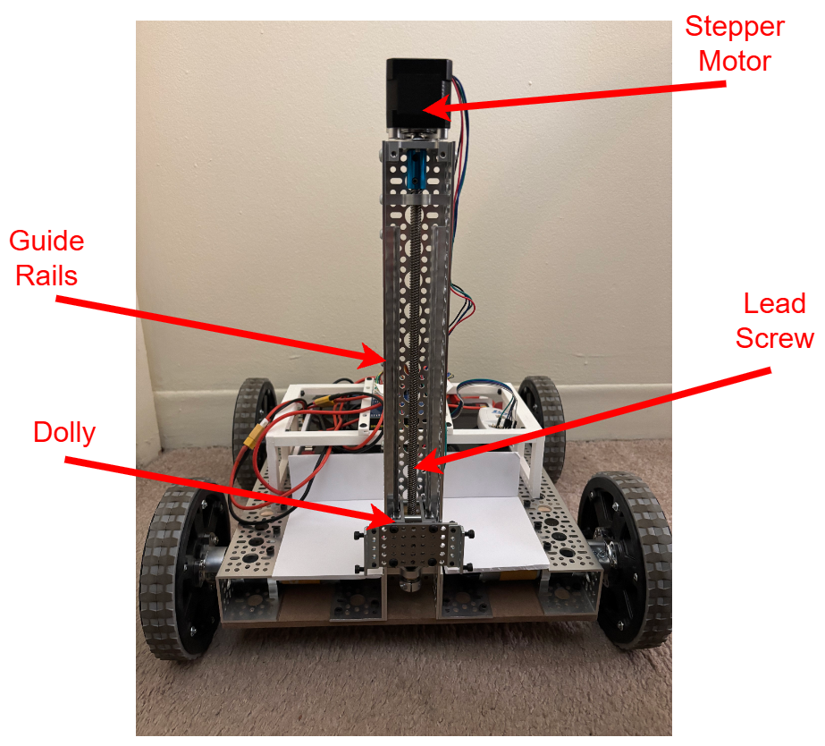_Linear Actuator_

The sensor unit is mounted on a linear actuator on the front of the robot.  The linear actuator lowers the sensor when collecting samples and raises it while the robot is moving to avoid dragging the bottom of the sensor across the surface being sampled.  The linear actuator consists of a guide rails, dolly, 8 mm lead screw, NEMA 17 stepper motor, and some additional mouting hardware.  The stepper motor is driven by an A4988 stepper motor driver, which is also controlled by the STM32 Teensy replacement.  The A4988 is configured with a microstep resolution of a sixteenth step, and another timer is used to pulse the step pin.  All parts aside from the stepper motor and stepper motor driver can be found on [gobilda.com](https://www.gobilda.com/).

### Communication

Communication with the Sensor STM32 is again handled over UART.  In this case, the UART connected to the USB Mini B port (USART2) is used because it provides a builtin USB to TTL adapter.  Data is framed using the following format.

| Delimiter 0 | Delimeter 1 | Command | Payload     |
| ----------- | ----------- | ------- | ----------- |
| 1 byte      | 1 byte      | 1 byte  | 0 - n bytes |

- Delimiter 0: 0xAA

- Delimiter 1: 0x55

- Command:
  
  - Start Sampling: 0x01U
  
  - Sampling Complete: 0x02U
  
  - Lower Sensor: 0x03U
  
  - Raise Sensor: 0x04U

- Payload: data with variable length

All frames are [COBS encoded](https://en.wikipedia.org/wiki/Consistent_Overhead_Byte_Stuffing) before being sent over the wire.  Currently, the payload field is only used by frames with the "Sampling Complete" command.  In this case, the payload consists of the individual ADC samples that comprise the complete waveform, with each byte in the payload corresponding to a sample of the upper eight bits as aforementioned.

A complete sample sequence looks like the following:

```
Controller           Sensor
    |                   |
    | Lower sensor      |
    | ----------------> |
    |                   |
    | Start sampling    |
    | ----------------> |
    |                   |
    |                   |
    | Sampling complete |
    | <---------------- |
    |                   |
    |                   |
    | Raise sensor      |
    | ----------------> |
    |                   |
```

Similar to the CAVeBoard-Mini, CAVeBox provides a Websocket gateway for wirelessly communicating with the Sensor as well.  The CAVeBox endpoint for handling communication with the sensor expects raw COBS encoded bytes, meaning any data sent or received to the endpoint must be COBS encoded or decoded after or before packing or unpacking, respectively, according to the framing format above.

## Operation

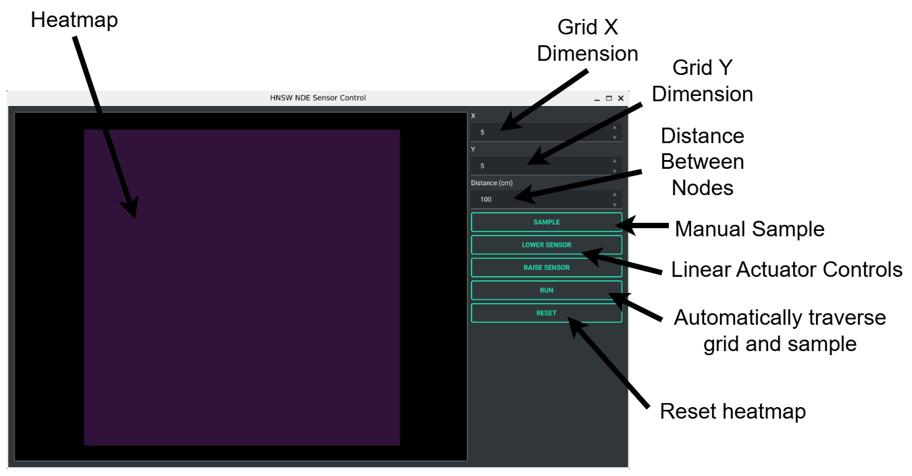_NDT Robot UI_

Operation of the robot is controlled through the NDT Robot UI, which is a simply UI written in Python with PyQT.  It allows a user to manually raise and lower the sensor and manually trigger a sensor sample.  It also allows a user to define a grid for the robot to traverse, with the robot collecting a sensor sample at each node.  After each sample is collected, it is added to a heatmap of the grid.  The NDT Robot UI communicates with the robot and sensor via the CAVeBox gateway.

To setup CAVeBox on a Raspberry Pi running Ubuntu Server:

1. Connect to Wi-Fi using a utility like [nmcli](https://documentation.ubuntu.com/core/explanation/system-snaps/network-manager/how-to-guides/configure-wifi-connections/).

2. Connect the UARTs from CAVeBoard-Mini and STM32 Nucleo-64 to the Pi.  For the CAVeBoard-Mini, the Raspberry Pi's GPIO natively supports UART, but a USB to TTL adapter can also be used (this requires less configuration).   For the STM32 Nucleo-64, the USB Mini B port can be connected to a USB Type A port on the Pi.  The serial devices corresponding to the CAVeBoard-Mini and STM32 Nucleo-64 must be known. On a Linux device, these typically have names like `/dev/ttyUSBx` or `/dev/ttyACMx` for USB to TTL adapters

3. Run CAVeBox with the command, `./CAVeBox <robot serial device> 1000000 <sensor serial device> 1000000 <plotting endpoint>` where `<robot serial device>` is the name of the serial device connected to the CAVeBoard-Mini and `<sensor serial device>` is the name of the serial device connected to the STM32 Nucleo-64.  The `<plotting endpoint>` argument is for if a user would like to plot telemetry data using an application like [Plotjuggler](https://plotjuggler.io/).  This can be useful when tuning the motion of the robot.  CAVeBox will establish a Websocket connection with a server running at this endpoint and send telemetry formatted as JSON.  On a Pi, the complete command to run CAVeBox would look something like `./CAVeBox /dev/ttyUSB0 1000000 /dev/ttyACM0 1000000 192.168.0.100`.

When running CAVeBox, make sure the robot is already powered on (lift the red E-stop button).  Three beeps from the robot should be heard when the robot powers on and successfully initializes all peripherals.  The light on top of the CAVeBoard-Mini should also turn green.  If no beeps are heard and/or the light remains yellow, there was an issue initializing one or more of the peripherals (e.g. the IMU was not detected or did not calibrate successfully).

_End-to-End System Diagram_

To run the UI, make sure CAVeBox is already running and the IP address of the device it is running on (e.g. the Pi) is known.

1. Make sure all Python dependencies list below are installed.
   
   Dependencies:
   
   - asyncio==4.0.0
   
   - cobs==1.2.2
   
   - colorama==0.4.6
   
   - Jinja2==3.1.6
   
   - MarkupSafe==3.0.3
   
   - numpy==2.2.6
   
   - pillow==12.0.0
   
   - PyOpenGL==3.1.10
   
   - PyQt6==6.10.1
   
   - PyQt6-Qt6==6.10.1
   
   - PyQt6_sip==13.10.3
   
   - pyqtgraph==0.14.0
   
   - pyserial==3.5
   
   - qt-material==2.17
   
   - websockets==15.0.1

2. Edit `ndt_robot_ui.py` and replace the `HOST` global variable with the IP address of the CAVeBox device, e.g. `HOST = "192.168.0.101"`.

3. Run the UI with `python3 ndt_robot_ui.py`.
